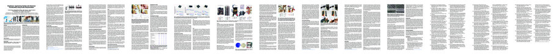

# PolySense

Where Material Sciences meet HCI and eTextiles...

## What?

Augmenting materials with electrical properties!?

  

These examples were polymerized to be used as sensors:
  - Left: this piece of "Kinesio tape" became a stretch sensor
  - Middle: this cotton glove was simply connected with alligator clips
  - Right: these leggings have a connecting layer underneath, documented on Kobakant (see next section)

The codes for the above examples are available here:
[github.com/counterchemists](https://github.com/counterchemists)

And the sensors are made according to the process described below:

## How?
### Documentation

Process + demo video:

Tutorial (+ logs):

  - [Hack A Day](https://hackaday.io/project/168380-polysense)

  - [Hackster](https://www.hackster.io/cedric/polysense-a36d44)

More on Kobakant:

  - [Interactive leggings AKA "hippie slide-control"](https://www.kobakant.at/DIY/?p=7823) (CCC preparation)

  - [Make your tech and wear it too](https://www.kobakant.at/DIY/?p=7737) (CCC talk)

  - [Speculating about piezoresistance](https://www.kobakant.at/DIY/?p=7832)

  - [Hydrogen Peroxide Etching](https://www.kobakant.at/DIY/?p=7841)

### Academic Publications

  - _PolySense: Augmenting Materials with Electrical Functionality (using In-Situ Polymerization)._
  [CHI 2020](https://chi2020.acm.org/) ||
[DOI](https://doi.org/10.1145/3313831.3376841) ||
[Open Access](files/PolySense.pdf) ||
[Video](https://www.youtube.com/watch?v=nmtneKl1_Ic)
  

  - _PolySense: How to Make Electrically Functional Textiles._
  [CHI 2020 (Interactivity Track)](https://chi2020.acm.org/) ||
[DOI](https://doi.org/10.1145/3334480.3383148) ||
[Open Access](files/PolySense_demo.pdf)
  

  - _Sketching On-Body Interactions using Piezo-Resistive Kinesiology Tape_
  [AH 2020](https://augmented-humans.org/) ||
[DOI](https://doi.org/10.1145/3384657.3384774) ||
[Open Access](files/PolySense_On-Body.pdf) ||
[Video](https://www.youtube.com/watch?v=LZDMlTWuRVw)
  

  - _Stymphalian Birds - Exploring the Aesthetics of A Hybrid Textile._
  [DIS 2020](https://dis.acm.org/2020) ||
[DOI](https://doi.org/10.1145/3393914.3395840) ||
[Open Access](files/Stymphalian-Birds.pdf) ||
[Video](https://youtu.be/CTibZL-BmbQ) ||
[more](https://audreybriot.fr/stymphalian-birds/)
  

## Why?

In this project we explore the process of polymerization to add electrical functionalities to everyday materials such as fabrics, or feathers, to transform them as sensors for example.

Creating one’s own sensitive textiles provides a plethora of opportunities:
For example, it means the freedom from constraints of store bought materials. Polymerization broadens the range of interactive objects which can be created. One might augment an existing and loved item, or create unique new materials and sensors by polymerizing items with unique properties such as tape or zippers.
Existing piezoresistive materials (pressure sensitive) also act as a black box in designs, it means that entrepreneurs, tailors, researchers, and hackers are dependent on a specific manufacturer. If this manufacturer changes their production process, this currently might make entire designs obsolete which can make it tricky to reproduce work or create products.

PolySense, our CHI publication, highlights how -- by framing polymerization as a dyeing process -- polymerization is a versatile and easy to deploy tool for creating fabric with custom electrical properties. We also show how to use etching on existing functional fabric to customize it. The resulting custom fabrics might be used as sensors or conductors and even whole circuits including sensing elements can be implemented in fabric only.

Other publications highlight specific pieces and technologies which are implemented using the process described in PolySense. For example, we demonstrate rapid prototyping of on-skin interaction, and showcase a hybrid art-piece which features polymerized feathers.

More:
  - [DataPaulette](http://datapaulette.org/work/topographie-digitale/)
  - [Saarland HCI](https://hci.cs.uni-saarland.de/research/polysense/)
  - [MIT Media Lab](https://www.media.mit.edu/projects/material-functionalization/overview/)

## Contacts

  - Core team: [CounterChemists+owners@googlegroups.com](mailto:CounterChemists+owners@googlegroups.com)

  - Mailing list: [https://groups.google.com/forum/#!forum/CounterChemists](https://groups.google.com/forum/#!forum/CounterChemists)

## Credits

The eTextile project was born in [DataPaulette](http://datapaulette.org) and the materials science research was conducted by Ana C. Baptista at [CENIMAT](https://www.cenimat.fct.unl.pt/). The HCI work was initiated by Paul Strohmeier at [Saarland HCI](https://hci.cs.uni-saarland.de/) and developed over a series of research visits by Hannah Perner-Wilson ([KobaKant](https://www.kobakant.at/DIY/)) and Cedric Honnet ([MIT](https://www.media.mit.edu/projects/material-functionalization/overview/)).

